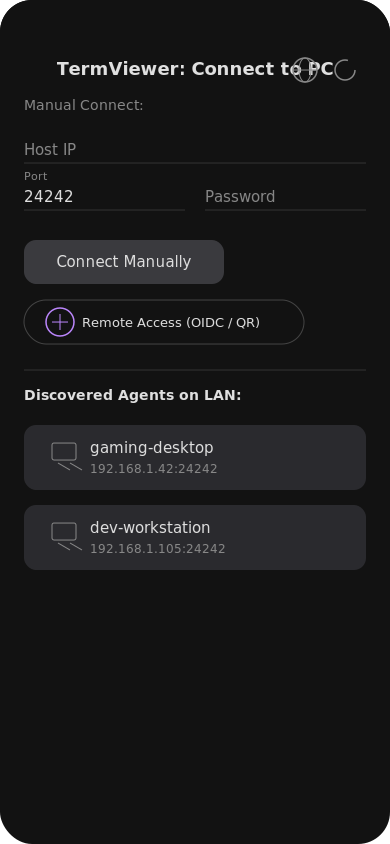
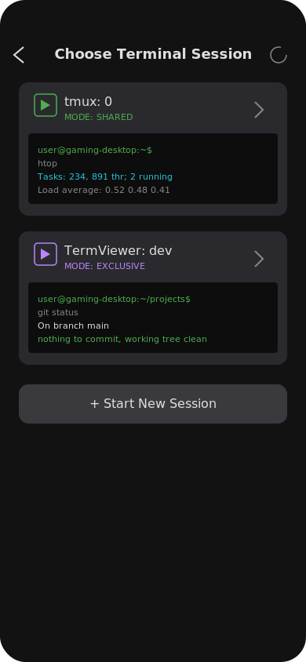
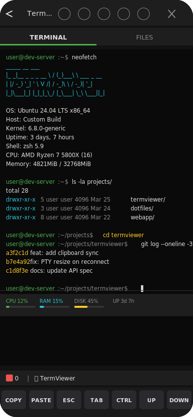
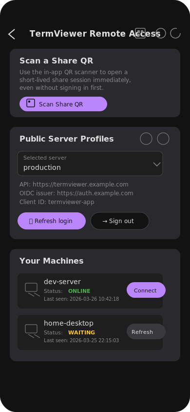
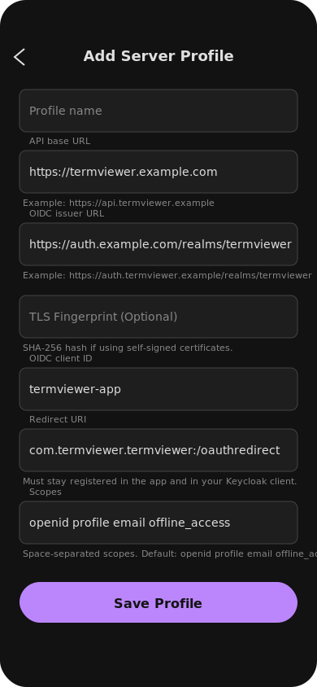

<div align="center">

# 📺 TermViewer

**Control your PC terminal from your phone — securely, instantly, anywhere.**

[](LICENSE)
[](https://go.dev)
[](https://flutter.dev)
[](https://nextjs.org)

[](https://buymeacoffee.com/mreuz)

</div>

---

TermViewer is a secure terminal streaming platform with two operational modes:

- **🏠 LAN Mode** (production-ready) — Go agent + Flutter client for local-network terminal sharing with zero-config mDNS discovery
- **🌐 Public Server Mode** (feature-complete foundations) — relay stack with Go backend, Next.js dashboard, and Keycloak identity for internet-facing access

---

## 📱 App Showcase

<div align="center">
<table>
  <tr>
    <td align="center">
      <br/>
      <b>Home & Discovery</b><br/>
      <sub>Auto-discover agents on LAN<br/>or connect manually</sub>
    </td>
    <td align="center">
      <br/>
      <b>Session Selection</b><br/>
      <sub>Choose tmux or TermViewer<br/>sessions with live previews</sub>
    </td>
    <td align="center">
      <br/>
      <b>Terminal View</b><br/>
      <sub>Full terminal with system HUD,<br/>file browser, and keybar</sub>
    </td>
  </tr>
  <tr>
    <td align="center">
      <br/>
      <b>Remote Access</b><br/>
      <sub>QR scanning, OIDC login,<br/>and machine management</sub>
    </td>
    <td align="center">
      <br/>
      <b>Server Configuration</b><br/>
      <sub>Configure public server profiles<br/>with OIDC and TLS settings</sub>
    </td>
    <td></td>
  </tr>
</table>
</div>

---

## ⚡ Quick Start

### LAN Mode

```bash
make build
./dist/termviewer-agent --password mysecret
```

Open the Flutter app — agents are discovered automatically via mDNS.

### Public Server (Development)

```bash
# Infrastructure
cd server/infrastructure && cp .env.template .env && docker compose up -d

# Backend
cd ../backend && cp .env.template .env && go run .

# Frontend
cd ../frontend && cp .env.template .env.local && npm install && npm run dev
```

---

## 🏗️ Architecture

### Tech Stack

| Layer | Technology |
|---|---|
| **Agent** | Go 1.25.8 · creack/pty · gorilla/websocket · hashicorp/mdns · ECDSA P-256 TLS |
| **Mobile App** | Flutter/Dart SDK ^3.11.3 · xterm.dart v4.0.0 · nsd (mDNS) · mobile_scanner · flutter_secure_storage |
| **Backend** | Go 1.25.8 · Fiber v2.52.12 · PostgreSQL 16 · GORM · gocloak v13 |
| **Frontend** | Next.js 16.2.0 · React 19.2.4 · TypeScript 5 · NextAuth 4.24.13 · PrimeReact 10.9.7 · Tailwind CSS 4 |
| **Infrastructure** | Traefik v3 (Let's Encrypt ACME) · Keycloak · PostgreSQL 16 · Docker Compose |

### Repository Layout

```
agent/            Go host agent — PTY/session handling, LAN WebSocket server, mDNS broadcast, system stats, recording
app/              Flutter mobile client — terminal emulation, discovery, file browser, themes, macros
server/backend/   Go backend for public relay, machine management, user onboarding, audit logging
server/frontend/  Next.js dashboard — machine management, QR sessions, admin console
server/infrastructure/  Local dev infrastructure (Traefik, Postgres, Keycloak docker-compose)
deploy/           Production and testing deployment configs with interactive setup.sh
packaging/        Systemd service unit for daemon deployment
docs/             Architecture, API, security, roadmap, and remote-access docs
```

---

## 🏠 LAN Mode Features

| Category | Details |
|---|---|
| **Discovery** | mDNS auto-discovery on local network |
| **Security** | TLS 1.3 with self-signed ECDSA P-256 certs · Trust-on-First-Use (TOFU) certificate pinning · HMAC-SHA256 challenge-response auth (password never on wire) |
| **Sessions** | Native TermViewer sessions and Tmux support · Session multiplexing (multiple concurrent clients on same PTY) · Dynamic PTY resize arbitration (smallest common denominator) |
| **File & Clipboard** | Bidirectional file transfer with UI browser · Bidirectional clipboard sync |
| **Recording** | Terminal recording in Asciinema v2 (`.cast`) format |
| **Monitoring** | System HUD — real-time CPU, RAM, disk, uptime (every 5s) |
| **UX** | Custom macros and configurable keybar toolbar · Terminal themes (Dracula, Nord, Solarized Dark, Monokai) · Virtual canvas (1200px) with pan/zoom for complex TUIs · Auto-scrolling viewport management |
| **Internals** | Per-connection write mutexes · Structured logging via `log/slog` · Ping/pong keep-alive |

---

## 🌐 Public Server Mode Features

| Category | Details |
|---|---|
| **User Management** | Registration with admin approval workflow · Email activation with 24h single-use tokens · OIDC/Keycloak integration for web login |
| **Access Control** | Role-based access (`termviewer-admin` and default user roles) · Admin approval console with Keycloak admin-role enforcement |
| **Machine Enrollment** | One-time `client_id` + `client_secret` (hashed, never re-displayed) · Machine heartbeat and online/offline presence tracking |
| **Session Relay** | Share-session lifecycle with short-lived, single-use session tokens · QR code generation from share-session tokens · WebSocket relay with strict session isolation (`session_id` → agent + mobile sockets) |
| **Data Security** | Row-Level Security (RLS) at PostgreSQL layer for tenant data isolation · Comprehensive audit logging (UserID, Action, Resource, IP, UserAgent) with configurable retention |
| **Dashboard** | Pending-approval and activation pages · Machine management and QR/share flow |
| **Mobile** | Flutter public-mode: OIDC login, QR scanning, machine-list flow |

### Still Growing

- OS-level deep-link handling
- Further UI polish across web and mobile public flows
- Broader production hardening (observability, admin ergonomics)
- Optional E2E encryption

---

## 🔐 Important: Remote-Access Security Model

TermViewer enforces **three separate identity layers** that must never be conflated:

| Layer | Purpose | Lifetime |
|---|---|---|
| **User auth** | OIDC / Keycloak login | Long-lived session |
| **Machine auth** | `client_id` + `client_secret` | Permanent (hashed at rest) |
| **Session auth** | Ephemeral QR tokens | Short-lived, single-use |

> **Key rules:**
> - Machine credentials and share-session tokens are different things
> - QR codes contain short-lived, single-use share-session tokens only — never machine credentials
> - The dashboard never exposes machine secrets after initial setup

---

## 🖥️ Agent CLI Reference

```
termviewer-agent [flags]
```

| Flag | Env Variable | Description |
|---|---|---|
| `--password` | `TERMVIEWER_PASSWORD` | Authentication password |
| `--port` | — | Custom port (default: `24242`) |
| `--command` | — | Custom shell command on startup |
| `--attach <session>` | — | Attach to a native TermViewer session locally |
| `--relay-url` | `TERMVIEWER_RELAY_URL` | Enterprise relay server WSS URL |
| `--client-id` | `TERMVIEWER_CLIENT_ID` | Enterprise client ID |
| `--client-secret` | `TERMVIEWER_CLIENT_SECRET` | Enterprise client secret |
| `--tls-skip-verify` | `TERMVIEWER_TLS_SKIP_VERIFY` | Skip TLS verification for relay |

---

## 🚀 Deployment

### Production / Testing

```bash
cd deploy
./setup.sh              # Interactive config generator (testing or production)
cd testing              # or cd production
docker compose up -d --build
```

The `setup.sh` generates all secrets, configures Traefik routing, provisions Keycloak, and wires PostgreSQL.

**Routing via Traefik:**

| URL | Service |
|---|---|
| `https://yourdomain.com` | Frontend |
| `https://yourdomain.com/api` | Backend REST API |
| `https://yourdomain.com/ws` | WebSocket relay |
| `https://auth.yourdomain.com` | Keycloak |

### Packaging

```bash
make build && make package    # .deb + .rpm via nFPM
```

Includes a systemd service unit. Supports Debian (`.deb`) and Red Hat (`.rpm`).

---

## 📚 Documentation

| Document | Description |
|---|---|
| [`GET_STARTED.md`](GET_STARTED.md) | LAN development and usage guide |
| [`docs/ARCHITECTURE.md`](docs/ARCHITECTURE.md) | LAN system architecture |
| [`docs/API_SPEC.md`](docs/API_SPEC.md) | Agent WebSocket protocol specification |
| [`docs/SECURITY.md`](docs/SECURITY.md) | Security model and operational guidance |
| [`docs/REMOTE_ACCESS_ARCHITECTURE.md`](docs/REMOTE_ACCESS_ARCHITECTURE.md) | Public server infrastructure and system design |
| [`docs/REMOTE_SESSION_FLOW.md`](docs/REMOTE_SESSION_FLOW.md) | User, machine, share-session, QR, and mobile OIDC flows |
| [`docs/ROADMAP.md`](docs/ROADMAP.md) | Feature roadmap and delivery status |

---

## 🤝 Contributing

Contributions are welcome! Whether it's bug reports, feature requests, or pull requests — all input is appreciated.

## 📄 License

This project is licensed under the [AGPLv3](LICENSE).

---

<div align="center">

⭐ If you find TermViewer useful, consider giving it a star!

<a href="https://buymeacoffee.com/mreuz"></a>

</div>
